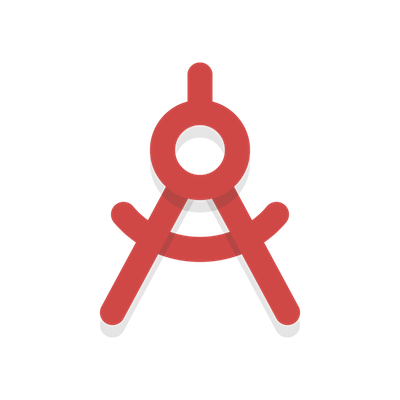

## Tooling


>The open source initiative to create a JSON-based standard for developer tooling and workflows.

In past few years ecosystem of tools has exploded and we have a lot more tools and techniques to help us build softwares. But with this growth comes complexity and confusion to come up with best tools to use. Productive developers in community surround themselves with powerful tools for different aspects of development and learn from each other's workflow. We believe that setting up a standard for developer tooling and workflows will allow developers to keep working productively and share it more effectively.

## What is tooling?
A tool(programming tool or software development tool) is a computer program that software developers use to create, debug, maintain, or otherwise support other programs and applications.

Check out the most famous tooling list by Paul Irish in JSON format [Tooling & The Webapp Development Stack ](https://github.com/ravisuhag/tooling/blob/master/examples/paulirish/webapp_development_stack.json)

## What is developer/designer workflow?
Workflows matter. A designer–developer workflow is the set of steps used to achieve a goal and refers to the way designers and developers work. The tools used to achieve these goals play a vital role in the workflow. For a developer, these tools are suites such as Atom, Grunt, SASS or ROR. For a designer, these tools include art programs such as Adobe Photoshop, Sketch. Your workflow is about the tools you use and your experience while using them.

## Roadmap
- To have a package system like NPM, Bower and other package managers
- Setting up platform to pick up tools out of community curated tooling list and create your own workflows.
- Setting up cli to answer questions like ```fetch workflow -u paulirish frontend-workflow```

## Contributing
This is an experimental project with big ambitions to make impact. Feel free to discuss ideas.
